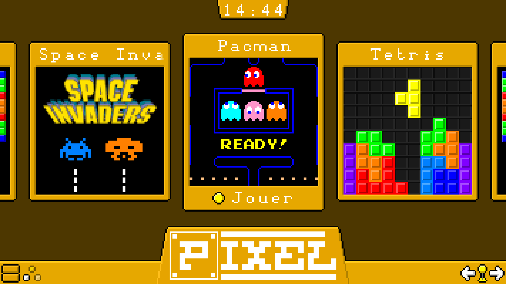

# pyArcade

Improved game launcher for the Pixel Arcade Cabinet



## Getting started

To run this project, you must use `python >= 3.5` and `pygame >= 2.0`. For example, you can install it with the following commands:
```bash
sudo apt-get install python3 python3-pygame
```

# Run the project

You can run the launcher with the following steps:
```bash
python3 main.py
```

# Add games

This feature is not yet implemented

## License

All the source code is licensed into the GNU GPL v3 license, see [LICENSE](LICENSE.MD) for more information.
All the resources are licensed into the Creative Commons BY-NC-SA license.
